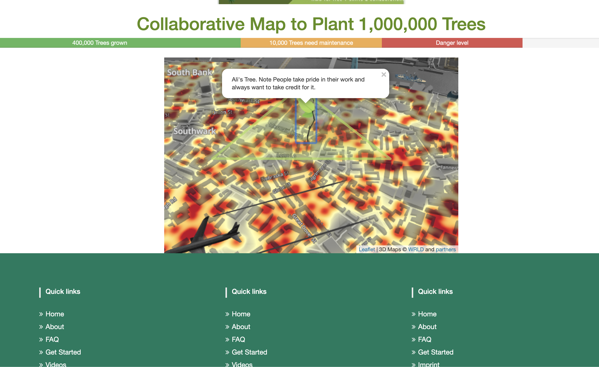

# MakeAmericaGreenAgain

Leaflet map implemented to show trees grown in the states (eventually the world)
What I want is for this to be a website where you can go in as a guest, plant a tree ( put a Leaflet marker), you can choose the marker's icon and you can name the tree or write a comment. No fuss or registration. I'll trust everyone with honor code!

Hello all,

Have you ever walked into an office and saw a map of the world and found that there are places where people have visited it?
This is an on-going personal project that I don't expect to make any profit off of.
I would like to build a website with a red heat map of the world. As guests plant more trees, people of the world need to collectively work together to plant trees. As we plant more trees, the map will slowly turn from red to green

Picture of my demo

In order to run the website locally, 
1. Clone the project
2. Run the command 'python -m SimpleHTTPServer' in terminal
3. Visit ython localhost (http://0.0.0.0:8000/quadtreemap.html).

Basically, I implemented a Leaflet map tutorial, then I added WRLD.js library to make it look pretty, I hardcoded a tree and green polygon. I also built a basic website UI with bootstrap but that's something easy.

Todo:
1. Make Database for all GeoJson object
2. Beautify the interface.
3. (High priority) Make markers placeable with clicks instead of hardcoded
4. Make the green polygon automatically placeable next to any tree instead of hardcoded

What I want is for this to be a website where you can go in as a guest, plant a tree ( put a Leaflet marker), you can choose the marker's icon and you can name the tree or write a comment. No fuss or registration. I'll trust everyone with honor code!

I know the ABC's of web dev but I don't know much about Databases or cloud development.

**What should my next step be?** I would appreciate any and all opinions
